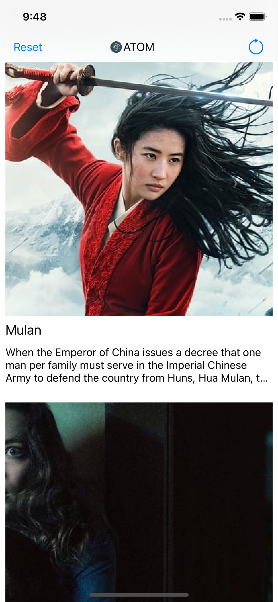
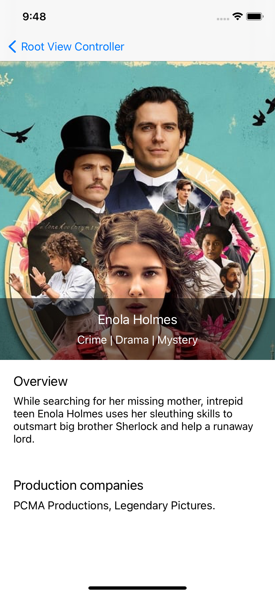

This app is presenting a list of movies taken from TMDB 

  
  

Video screen recording:  https://www.youtube.com/watch?v=pcWNX3TOO8Q

### Instructions to run

- Open a terminal at folder Atom Movie Listing and open Atom Movie Listing.xcodeproj

### Note to the evaluator

Make comments for me inside the code. 

### How the app works

The app stores movie entries in Core Data. The entries get updated every 3 hours trough a background task.

## Objectives for today Friday Nov 20th 2020

Make a plan. Think about app structure.
Draw the scheckes in AdobeXD
Build the basic iOS app: list screen and detail screen

## Objectives for today, Saturday Nov 21 
Make the app update in the background every 3 hours. Save entries into Core Data
Think about image caching
Build the Detail screen
Make it work offline

